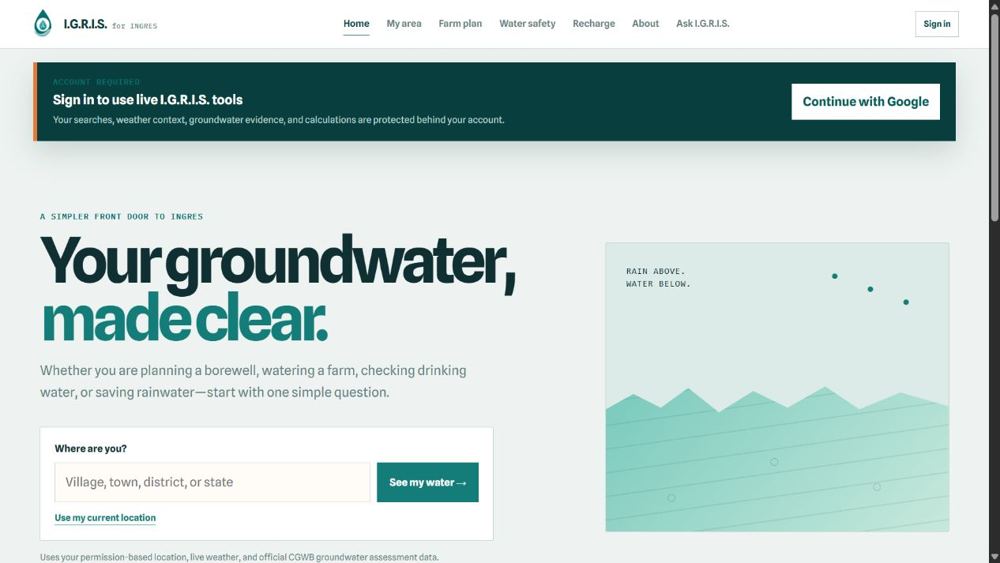
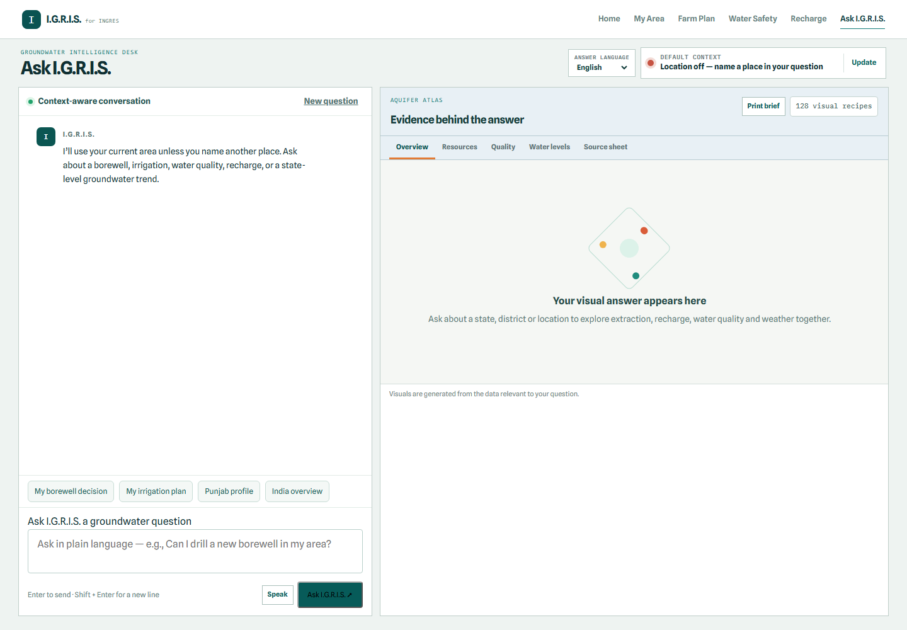

# 🌊 I.G.R.I.S. (Intelligent Groundwater Resource Insight System)

> **AI-Driven Conversational Virtual Assistant & Analytics Dashboard for INGRES**  
> **Smart India Hackathon (SIH) 2026** | **Problem Statement:** `SIH25066`  
> **Organization:** Ministry of Jal Shakti / Central Ground Water Board (CGWB)  
> **Category:** Software | **Theme:** Smart Automation

[](https://igris.site)
[](https://igris.site/api/health)

---

## 📌 Project Overview
**I.G.R.I.S.** is a multilingual, location-aware groundwater assistant designed as a simpler front door to **INGRES** (India-Groundwater Resource Estimation System).

It transforms dense national assessments, 36 state fact sheets, and **6,635 block-level records** into understandable evidence for farmers, residents, businesses, and public officials.



The assistant understands phrases such as **“my area”** as the user's selected or permission-based location, while an explicitly named place overrides that context. It combines official CGWB evidence, transparent assessment-unit matching, and live weather without presenting regional data as a measurement of an individual well.

> **Live:** [igris.site](https://igris.site) · Static pages are public; live tools and model generation require Google sign-in.

---

## 🏛️ System Architecture & Data Assets

```
INGRES Government Data & Reports
   │
   ├──> Unified Master Database (SQLite: data/processed/ingres_master.db)
   │      ├── 36 States & UTs Summary (Recharge, Extraction, SoE %)
   │      ├── 6,635 Block Categorizations (Safe, Semi-Critical, Critical, Over-Exploited)
   │      ├── 141 State Water Quality Contamination Records (Fluoride, Arsenic, Nitrate, Uranium)
   │      └── 61 Water Table Depth Trends (Pre vs Post-Monsoon)
   │
   ├──> AI RAG Knowledge Corpus (data/processed/state_factsheets_corpus.json)
   │
   └──> I.G.R.I.S. Decision Engine
          ├── Context-aware location resolver (GPS, locality, city, district, state)
          ├── DeepSeek chat with a fail-closed, server-side admin kill switch
          ├── 128 visualization recipes across 12 evidence families
          ├── Cached Open-Meteo weather plus deterministic irrigation rules
          └── Original CGWB fact-sheet evidence viewer
```

```text
Browser (igris.site / www.igris.site)
        │  HTTP-only Google session
        ▼
Cloudflare Worker + Static Assets
        │  encrypted gateway credential
        ▼
Nginx → FastAPI (127.0.0.1:8010) → SQLite / CGWB data / DeepSeek
```

---

## 📁 Repository Structure

```
.
├── data/
│   ├── processed/
│   │   ├── ingres_master.db                  # Unified SQLite Master Database (6,635 blocks)
│   │   ├── state_factsheets_corpus.json      # Semantic RAG Knowledge Corpus (36 states)
│   │   └── india_all_blocks_categorization_2025.csv # 6,635 Block Records
│   ├── raw/
│   │   ├── cgwb_official/                    # Official CGWB GWRA block categorization PDFs
│   │   ├── state_fact_sheets_2025/           # 36 Official State & UT Fact Sheet PDFs (2025)
│   │   ├── opencity_gw_2024/                 # State & City Ground Water CSV datasets
│   │   └── CGWB_Dynamic_GW_Resources_India_2025.pdf # National Ground Water Assessment Report
│   ├── build_master_database.py              # Master data ingestion pipeline
│   └── generate_pdf_guide.py                 # PDF documentation generator
├── frontend/                                  # Responsive citizen experience
├── frontend-worker/                           # Cloudflare Worker + static asset deployment
├── edge-gateway/                              # Private same-origin API gateway Worker
├── server/                                    # FastAPI context, chat, data, and visual APIs
├── deploy/                                    # Isolated Nginx and systemd production units
├── docs/                                      # Product screenshots
├── SIH2026_INGRES_AI_Assistant_Complete_Guide.pdf # Complete Project Guide for NotebookLM
└── README.md
```

---

## 🚀 Key Features
1. **Context-aware groundwater copilot**: “My area” uses GPS or the active selection; a named location such as *Kalwad Wasti, Pune* intelligently overrides it.
2. **Resilient neighborhood search**: OpenStreetMap-backed suggestions, spelling/transliteration fallback, exact coordinates, and transparent nearest-assessment matching.
3. **Evidence canvas**: 128 selectable visualization recipes covering resource balance, extraction stress, quality, depth, trends, weather, comparisons, actions, and source evidence.
4. **Original source sheets**: Inspect indexed CGWB state fact-sheet pages in a fit-to-page viewer or a zoomable full-screen evidence dialog.
5. **Citizen workflows**: Dedicated pages for local status, farming decisions, water safety, and rooftop recharge planning.
6. **Multilingual interaction**: English plus all 22 Scheduled Languages of India, language-matched browser speech recognition where supported, printable decision briefs, responsive navigation, and keyboard-friendly controls.
7. **Live local context**: Open-Meteo conditions and forecast data turn official annual assessments into practical “what should I do today?” guidance.
8. **Zero-token decision tools**: Farm planning, local status, water safety, and recharge estimates use deterministic calculations and indexed evidence—not DeepSeek tokens.
9. **Fail-closed model control**: When the administrator disables DeepSeek, chat returns `503` before conversation creation, evidence gathering, fallback generation, or any paid request.
10. **Private citizen accounts**: Google verifies identity, every functional API requires a valid session, and account-owned conversations retain their evidence canvas for later review.



---

## 🧑‍💻 Run Locally

```powershell
cd server
pip install -r requirements.txt
python -m uvicorn main:app --host 0.0.0.0 --port 8000
```

Open [http://localhost:8000](http://localhost:8000). Location search and weather require internet access and a signed-in account. Browser speech recognition depends on browser support; Chrome and Edge provide the most reliable experience.

### Google sign-in

1. Create an OAuth 2.0 **Web application** in Google Cloud Console.
2. Add these exact entries under **Authorised JavaScript origins**—without trailing slashes:
   - `http://localhost:8000`
   - `http://127.0.0.1:8000`
   - `https://igris.site`
   - `https://www.igris.site`
3. Copy `.env.example` to `.env`, set `GOOGLE_CLIENT_ID`, and generate a long random `AUTH_SESSION_SECRET`.
4. Keep `.env` private. The browser receives only the public client ID; Google credentials are verified server-side and I.G.R.I.S. stores no Google password.

The Google Identity button used here validates an ID token, so the OAuth client secret is never sent to or used by the browser. The screenshot error `no registered origin` is fixed in Google Cloud Console by adding the current origin to the list above; changing application code or the client secret cannot register that origin.

Every functional API is protected by an HTTP-only, SameSite session cookie. Static explanatory pages remain viewable, but location search, weather, groundwater evidence, source sheets, calculators, and chat require a verified account. Speech recognition is performed by the browser and does not run a transcription model on the VPS. Private conversations are stored in the ignored runtime database at `data/runtime/igris_accounts.db`.

### Production topology

The `igris` Cloudflare Worker serves `frontend/` as static assets on `igris.site` and `www.igris.site`, applying the production Content Security Policy and browser permission policy to every asset response. A separate gateway Worker handles same-origin `/api/*` requests, adds an encrypted gateway credential, and forwards them to `api.igris.site`. FastAPI rejects requests that bypass the gateway. Uvicorn remains isolated on `127.0.0.1:8010` behind Nginx. Configure the VPS with:

```env
APP_ENV=production
AUTH_COOKIE_SECURE=true
ALLOWED_ORIGINS=https://igris.site,https://www.igris.site
ALLOWED_HOSTS=api.igris.site
SERVE_FRONTEND=false
GATEWAY_SHARED_SECRET=replace-with-the-worker-secret
GATEWAY_ENFORCEMENT=true
ADMIN_EMAILS=your-verified-admin@example.com
LLM_BASE_URL=https://api.deepseek.com
LLM_MODEL=deepseek-v4-flash
DeepSeek_Key=replace-on-the-server-only
LLM_MAX_TOKENS=800
LLM_DAILY_USER_LIMIT=20
LLM_GLOBAL_DAILY_LIMIT=300
```

The LLM starts disabled in the private runtime database. Only a Google-verified account listed in `ADMIN_EMAILS` can read or mutate `/api/admin/*`; all enforcement occurs server-side. When generation is disabled, the chat endpoint fails closed and does not return a synthetic fallback answer. Daily reservations are atomic across workers, and only a one-way hash of the Google subject is sent as DeepSeek's `user_id`.

### Cost boundaries

| Feature | Data source | DeepSeek tokens |
|---|---|---:|
| Ask I.G.R.I.S. chat | CGWB evidence + DeepSeek | Yes, only when enabled |
| My Area | Indexed CGWB data + cached weather | 0 |
| Farm Plan | Cached weather + deterministic agronomy rules | 0 |
| Water Safety | Indexed state water-quality evidence | 0 |
| Recharge Planner | Local engineering calculation | 0 |

The admin switch controls **paid DeepSeek chat generation only**. Disabling it immediately prevents paid model calls while leaving authenticated, rule-based tools available.

Keep `GOOGLE_CLIENT_ID`, `AUTH_SESSION_SECRET`, `DeepSeek_Key`, `GATEWAY_SHARED_SECRET`, the account database, and any immutable admin subject IDs on the VPS—not in frontend files or GitHub. Store the matching gateway value as the Worker's encrypted `IGRIS_GATEWAY_KEY` secret. Put the VPS environment at `/etc/igris/igris.env` with owner-only permissions. The reference systemd and Nginx units are in `deploy/` and intentionally use a dedicated unprivileged `igris` account without changing other applications on the server. Follow the staged activation procedure in `edge-gateway/README.md` to avoid downtime.

### Model upgrades

The configured DeepSeek model runs with an 800-token ceiling to control cost. The owner can later change `LLM_MODEL` server-side; location resolution, structured evidence retrieval, account security, conversation history, and deterministic visual rendering remain model-independent.

### Core APIs

- `GET /api/health` — public service health without protected groundwater data.
- `GET /api/local-context/search?query=...` — resolve a named place and return groundwater plus weather context.
- `GET /api/location/suggest?query=...` — locality autocomplete and transliteration-aware suggestions.
- `POST /api/chat` — context-aware groundwater answers and visualization payloads.
- `GET /api/visualizations/catalog` — the complete visualization recipe catalog.
- `GET /api/factsheets/{state}/pages/{page}.png` — rendered official source-sheet evidence.

Except for health and authentication bootstrap routes, API endpoints require both the private Worker gateway credential and a valid citizen session.

---

## 🎬 90-Second Judge Demo
1. Search **Sangrur, Punjab** as a farmer. IGRIS returns **“Do not expand extraction”**, the official *Over-Exploited* classification, Punjab’s resource context, and immediate conservation actions.
2. Switch to **Haveli, Pune, Maharashtra** as a resident. The verdict becomes **“Proceed with safeguards”**, illustrating that the product is location-specific rather than alarmist.
3. Use **Plan recharge** to turn a 1,000 sq ft rooftop into a tangible annual water-capture and storage estimate.
4. Ask the follow-up chat: *“Can I drill a borewell in Sangrur?”* to demonstrate the grounded conversational layer.

The decision brief is an evidence-based screening tool, never a substitute for statutory clearance, a well-level water test, or a local hydrogeological survey.

---

## 👥 Developed by [Emogi](https://emogi.in)

I.G.R.I.S. is designed and developed by **Emogi**, a team focused on making complex intelligent systems clear, useful, and accessible.

**Team Emogi · JSPM University, Pune**

**Department:** School of Computational Sciences | **Program:** B.Tech AI/ML (SY)

| # | Member Name | Role |
|:---:|:---|:---|
| 👑 | **Ritesh Verma** | **Team Leader** |
| 🧑‍💻 | **Utkarsh Mishra** | AI/ML Developer |
| 👩‍💻 | **Stuti Priya** | AI/ML Developer |
| 🧑‍💻 | **Parth Wade** | Data & Fullstack |
| 👩‍💻 | **Swapnali Ubale** | AI/ML Developer |
| 🧑‍💻 | **Prince Gaur** | Backend & GIS |

---

## 📜 Problem Statement Details
- **Competition:** Smart India Hackathon (SIH) 2026
- **Problem Statement ID:** `SIH25066`
- **Title:** Development of an AI-driven ChatBOT for INGRES as a virtual assistant
- **Ministry / Organization:** Ministry of Jal Shakti / Central Ground Water Board (CGWB)
- **Theme:** Smart Automation
- **Category:** Software
- **Repository:** [https://github.com/Imimi328/I.G.R.I.S.](https://github.com/Imimi328/I.G.R.I.S.)
