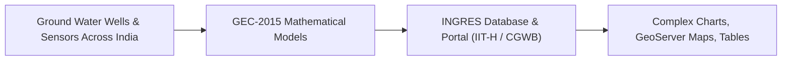
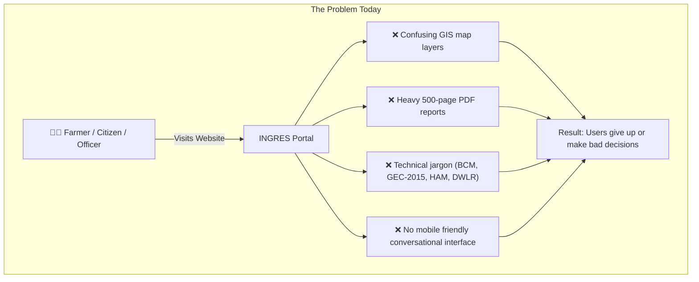
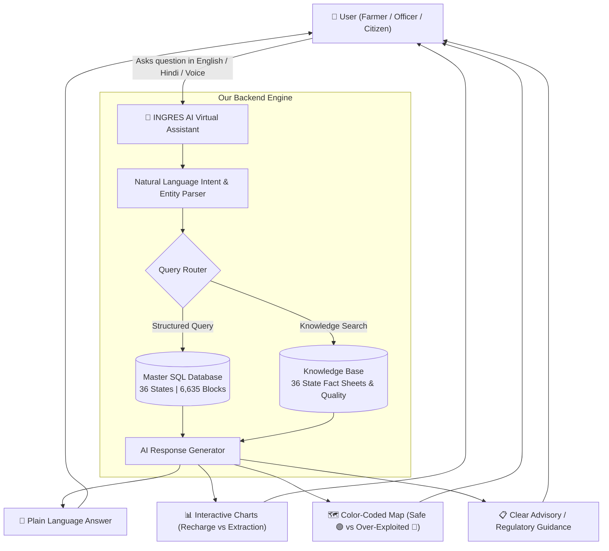

# 🌊 SIH 2026: Complete Guide to Problem Statement SIH25066
## AI-Driven Virtual Assistant for INGRES (Ministry of Jal Shakti)

---

## 1. The Real-World Problem: What is Happening to India's Water?

India is the **largest user of groundwater in the world** — pulling more groundwater every year than China and the United States combined. 

Over **85% of India's drinking water** and **60% of agricultural irrigation** comes from deep underground aquifers (water stored below ground like an underground lake).

```
   🌧️ Rain falls from sky (RECHARGE) 
         │
         ▼  (Water seeps into ground)
   ┌───────────────────────────────────────────────┐
   │             UNDERGROUND AQUIFER               │
   │  (Think of this like a giant water bank)      │
   └───────────────────────────────────────────────┘
         │
         ▼  (Water pumped out by tube wells)
   🚰 Borewells & Pumps (EXTRACTION) for Farming, Cities, Industries
```

---

## 2. Plain-English Glossary: What Do These Terms Mean?

Think of groundwater like a **Bank Account**:

| Technical Term | What It Actually Means | Bank Account Analogy |
| :--- | :--- | :--- |
| **Groundwater Recharge** | The amount of rain & canal water that seeps into the ground each year to refill the underground water table. | **Money you deposit** into your bank account. |
| **Groundwater Extraction** | The total water pumped out using borewells/motors for farming, drinking, and factories. | **Money you withdraw / spend** using your ATM card. |
| **Extractable Resource** | The safe portion of recharge that you can take without damaging natural rivers and streams. | Your **available spending balance**. |
| **Stage of Extraction (SoE %)** | $\frac{\text{Total Extraction}}{\text{Extractable Resource}} \times 100$ <br/>Percentage of available water being pumped out. | **Spending Ratio**: How much of your deposit you are burning through. |
| **BCM** | **Billion Cubic Meters** — standard unit used to measure massive volumes of water. | The currency units (e.g. ₹ Crores). |
| **Assessment Unit / Block** | A administrative sub-division of a district (like a Tehsil/Taluk/Mandal). | Individual branch accounts. |

---

## 3. The 4 Danger Categories (Stage of Extraction)

When the government measures each of India's **6,635 blocks**, they classify them into 4 categories:

```
  0% ──────────── 70% ──────────── 90% ──────────── 100% ────────────> 150%+
 ┌────────────────┬────────────────┬────────────────┬────────────────────────┐
 │   🟢 SAFE      │🟡 SEMI-CRITICAL│  🟠 CRITICAL   │   🔴 OVER-EXPLOITED    │
 │ (Spending <70%)│ (Spending 70-90)│ (Spending 90-100)│(Spending >100% of income)│
 │ New borewells  │ Caution needed │ Severe stress  │ Water level plummeting!│
 │ allowed easily │                │                │ Strict NOC needed!     │
 └────────────────┴────────────────┴────────────────┴────────────────────────┘
```

* **🟢 Safe (≤ 70%)**: Water is refilling faster than it is being pumped out.
* **🟡 Semi-Critical (70% - 90%)**: Water use is getting close to the danger mark.
* **🟠 Critical (90% - 100%)**: Almost 100% of replenishable water is being used up.
* **🔴 Over-Exploited (> 100%)**: **DISASTER ZONE**. People are pumping out more water than rain can replenish (e.g., Punjab is at 156%, Rajasthan is at 150%). Water tables are drying up fast.

---

## 4. What is INGRES? (What the Government Already Built)

**INGRES** stands for **INdia-Groundwater Resource Estimation System**.

It is an official web portal built by the **Central Ground Water Board (CGWB)** and **IIT Hyderabad**.
- It collects water data from thousands of sensor wells across all states.
- It calculates the recharge, extraction, and danger category for every block.



---

## 5. The Core Problem We Are Solving (Why INGRES Needs a Chatbot)

Even though INGRES has all this valuable data, **regular people and even district officers cannot easily use it**:



### Specific pain points:
1. **A Farmer** wants to know: *"Is it safe to dig a 200ft borewell in my village, or is water drying up?"* — Today, he has to navigate complex GIS maps that he can't understand.
2. **A Factory Owner** wants to know: *"Can I get a CGWA NOC license for a food processing unit in Jaipur?"* — Needs clear regulatory status, but gets raw data tables.
3. **A District Collector / Government Officer** wants to know: *"Which 5 blocks in my district need urgent rainwater harvesting funds?"* — Has to manually analyze dozens of pages of PDF tables.

---

## 6. Our Solution: The AI Virtual Assistant for INGRES

We are building an **intelligent, multilingual AI chatbot and dashboard** that sits on top of INGRES data.



---

## 7. Real Example of How It Works

### Example Interaction:
> **User asks:** *"What is the groundwater situation in Sangrur, Punjab? Can I set up a new irrigation tube well?"*

### What Our AI Assistant Does:
1. Identifies location: `State: Punjab`, `District: Sangrur`.
2. Queries the database: Sangrur's stage of extraction is **>150% (Over-Exploited)**.
3. Queries water quality: High salinity & nitrate in shallow aquifer.
4. **Generates Response:**
   - 🔴 **Status Alert:** Sangrur is categorized as **Over-Exploited**. Extraction drastically exceeds natural rain recharge.
   - 📊 **Visual Card:** Donut chart showing 95% of water is consumed by paddy irrigation.
   - ⚠️ **Advisory:** New commercial borewells are restricted under CGWA guidelines. Strongly recommends drip irrigation and artificial recharge shafts.
   - 🗺️ **Map Pin:** Shows Sangrur highlighted in red on an interactive map.

---

## 8. Summary of What We Need to Build for the Hackathon

1. **Frontend**: A conversational UI with dark mode, interactive charts, and live maps.
2. **Backend**: An API engine connected to our unified `ingres_master.db` (6,635 blocks + 36 states).
3. **AI Layer**: An LLM (Gemini) that converts natural language into database queries and synthesizes helpful answers with zero hallucination.
4. **Multilingual Voice/Text**: Hindi and English support so anyone can use it.
